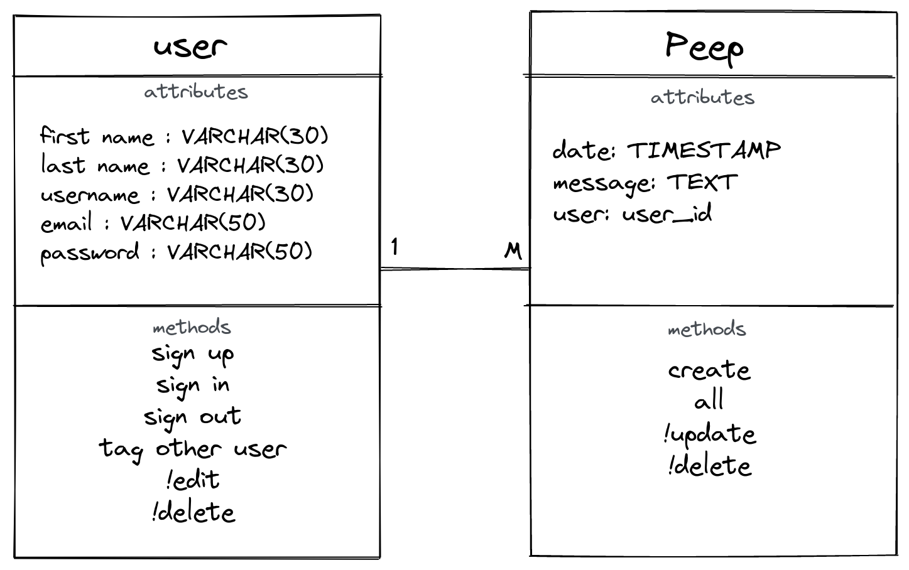

Chitter Challenge
=================

A small Twitter clone that will allow the users to post messages to a public stream.

To use this project [visit the heroku page]()

To view kanban, [visit the trello board](https://trello.com/b/gc3aEDuL/chitter-challenge)

[Planning](#Planning) | [Design](#Design) | [Testing and Development](#Work)| [CD/CI](#CD/CI)|


<h2 id="Planning">Planning</h2>

------------------------------------

[User Stories](#user_stories) | [Domain Models](#domain_models)| [Http Request](#http_request) | [Wireframes](#wireframes)| [Dependencies](#dependencies)

 <h3 id="user_stories">User Stories</h3>

Below are the user stories to use for building this project

```
STRAIGHT UP

As a Maker
So that I can let people know what I am doing  
I want to post a message (peep) to chitter

As a maker
So that I can see what others are saying  
I want to see all peeps in reverse chronological order

As a Maker
So that I can better appreciate the context of a peep
I want to see the time at which it was made

As a Maker
So that I can post messages on Chitter as me
I want to sign up for Chitter

HARDER

As a Maker
So that only I can post messages on Chitter as me
I want to log in to Chitter

As a Maker
So that I can avoid others posting messages on Chitter as me
I want to log out of Chitter

ADVANCED

As a Maker
So that I can stay constantly tapped in to the shouty box of Chitter
I want to receive an email if I am tagged in a Peep

As a Maker
So that others can see what I look like
I want to have a profile picture
```

<h3 id="domain_models">Domain models</h3>

| Object | Action |
|--------|--------|
|User| post a message (peep)|
||sign up for chitter|
||log in to chitter|
||logout of chitter|
||receive an email if you are tagged in a peep|
|Peep|see the time at which it was made|
||see all peeps in reverse chronological order|



<h3 id="http_request">HTTP request</h3>


<h3 id="wireframes">Wireframes</h3>

#### Mobile
<div style="display:flex; gap:50px;">


</div>


#### Wider screens


<h3 id="dependencies">Dependencies</h3>

|Name|Type|Use|
|-----|----|----|
|[rspec](https://github.com/rspec/rspec-metagem)|Testing|Behaviour Driven Development for Ruby|
|[capybara](https://github.com/teamcapybara/capybara#using-capybara-with-rspec)|Testing| Integration testing tool|
|[simplecov](https://github.com/simplecov-ruby/simplecov)|Testing|Code coverage analysis tool for Ruby|
|[simplecov-console](https://github.com/chetan/simplecov-console)|Testing|A simple console output formatter for SimpleCov|
|[rubocop](https://rubocop.org/)|Testing|Ruby linter|
|[pg](https://github.com/ged/ruby-pg)|Database|Ruby interface to Postgresql RDBMS|
|[sinatra](http://sinatrarb.com/)|Development| Web application library|
|[sinatra-contrib](http://sinatrarb.com/contrib/)|Development|Automatically reloads Ruby files on code changes|
|[dotenv](https://github.com/bkeepers/dotenv)|Development|Loads environment variables|
|[bcrypt](https://github.com/bcrypt-ruby/bcrypt-ruby)|Development|Stores a secure hash of users passwords|
